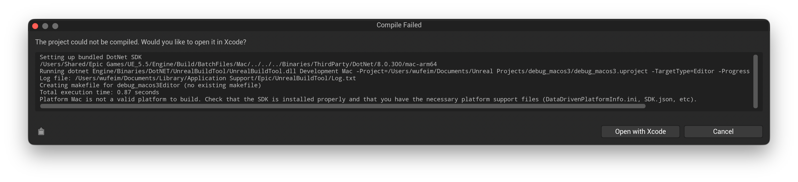

Troubleshooting
===============

1. Artifacts and low-quality rendering with Lumen
-------------------------------------------------

Current :code:`LychSim` implementation may not fully support Lumen features and may exhibit artifacts or lower quality rendering compared to native Lumen.

**Fix.** Planned to be fixed in future releases.

.. figure:: figures/lumen.png

   Artifacts and low-quality rendering with Lumen.

2. Cannot connect to UE5
------------------------

This issue may arise when the default port, *i.e.*, 9000, is blocked or in use by another process. This is often caused by previously uncleaned instances of the server or other applications occupying the same port.

**Fix.** Run :code:`netstat -ano | findstr :9000` to check for unwanted processes. Then kill these processes using :code:`taskkill /PID <pid> /F`.

3. Platform Mac is not a valid platform to build
------------------------------------------------

This issue may arise when using an un-supported Xcode version.

   Platform Mac is not a valid platform to build.

**Fix.** First download a supported Xcode version, e.g., `16.4`, from `xcodereleases.com <https://xcodereleases.com/>`_. Unzip the Xcode and you will see the following.

   Downloaded Xcode 16.4.

Then use `xcode-select` to ensure 16.4 is the default command-line build tool.

.. code-block:: bash

   sudo xcode-select -s /Users/wufeim/Documents/Xcode.app/Contents/Developer

   # optionally, verify the selected version
   xcode-select -p

Link the plugin code following the `installation instructions <https://wufeim.github.io/LychSim/tutorials/installation.html#install-and-compile-lychsim-plugin>`_. Open the project and you will see the prompt to compile the `LychSim` plugin. Everything should work now.

   Prompt to compile the LychSim plugin.

   LychSim plugin compiling...
