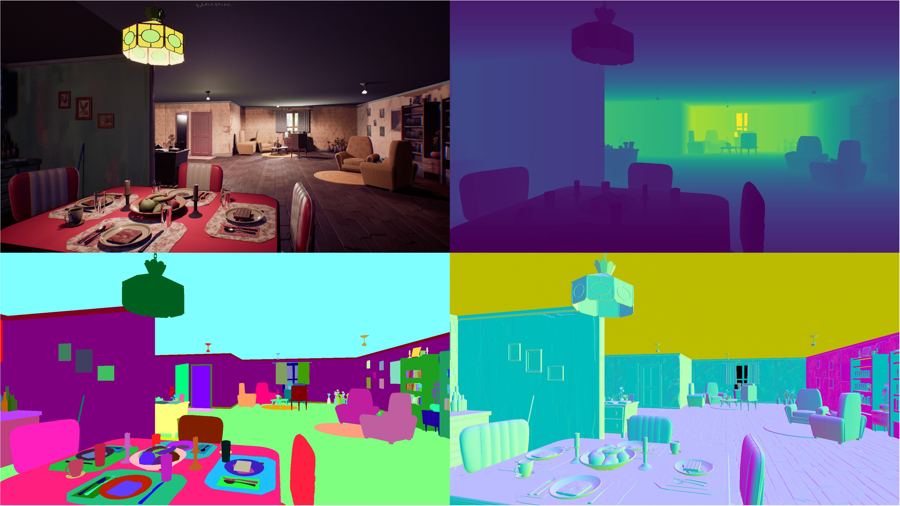
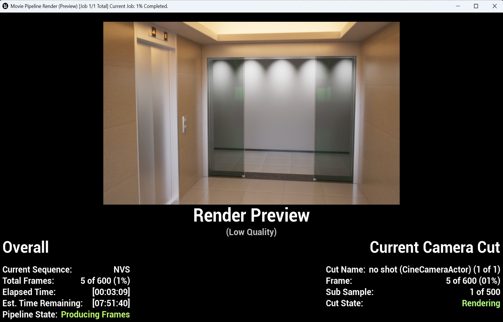
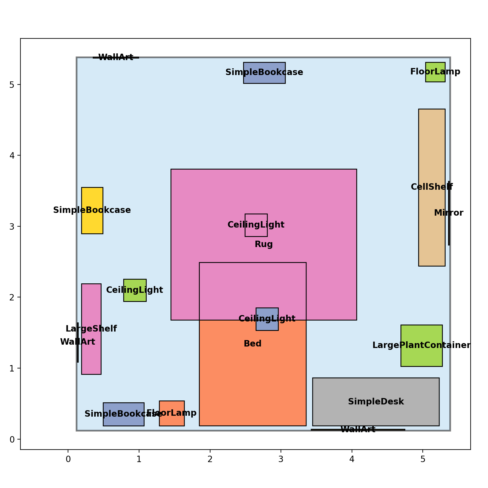
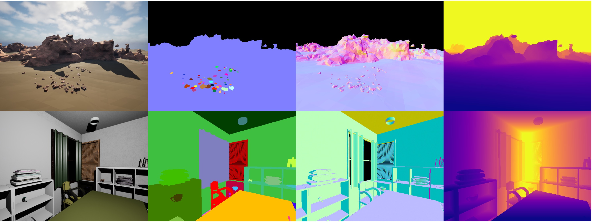
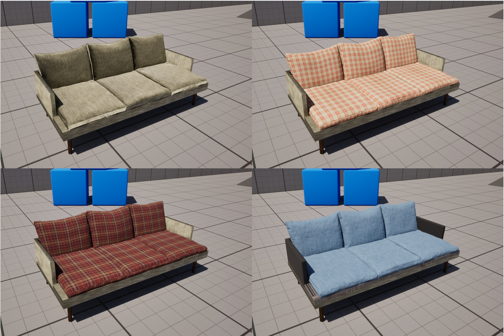
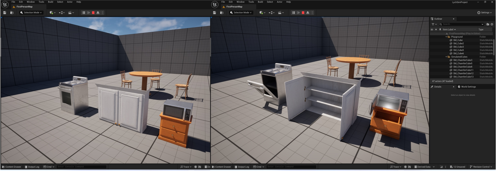
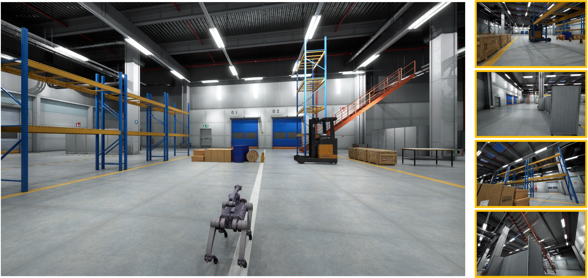

Introducing LychSim
===================

Comprehensive 2D and 3D Annotations
-----------------------------------

LychSim provides detailed 2D and 3D annotations for various objects, including:

1. **Scene-level annotations**: scene graph, camera parameters, lighting conditions, etc.
2. **Object-level annotations**: 2D/3D bounding boxes, instance segmentation, z-buffer, etc.
3. **Part-level annotations**: object part segmentation, part visibility, etc.
4. **Pixel-level annotations**: depth map, surface normals, panoptical segmentation, optical flows, etc.

   Rendering and pixel-level annotations.

.. figure:: figures/intro/parts.jpg
   :align: center
   :width: 100%

   Object part segmentations.

Rendering Quality
-----------------

In LychSim, we support two types of rendering: (1) real-time rendering, and (2) offline path-tracing rendering.

   Offline rendering with Movie Render Queue.

Scene Customization
-------------------

In LychSim, users can easily cutomize scenes in multiple ways. For example, users can rearrange furniture layouts to create new scenes by (1) dragging and dropping objects, (2) importing scene layouts from other datasets or engines, and (3) generating new layouts using large language models, such as `Holodeck <https://yueyang1996.github.io/holodeck/>`_ and `LayoutVLM <https://ai.stanford.edu/~sunfanyun/layoutvlm/>`_.

   Creating new scenes by importing scene layouts.

   Directly importing scenes from Inifinigen.

Besides scene layouts, materials of object parts can also be modified to create new scenes.

   Altering materials of object parts from Python API.

Identifying Adversarial Examiners
---------------------------------

We identify adversarial examiners that expose the limitations of state-of-the-art artificial intelligence and computer vision models. For example, we adopt reinforcement learning to find adversarial viewpoints that can easily fool object detection models, as shown in the following figure.

   An adversarial viewpoint found by reinforcement learning.

Agent Interaction
-----------------

LychSim supports various modes of agent interaction, such as object interaction and manipulation. See `this video <https://www.youtube.com/watch?v=W16W_a-57r0>`_ for a demonstration.

   Object interaction.

Embodied Evaluation
-------------------

LychSim enables real-time interaction between the Python API and the Unreal Engine, allowing for embodied evaluation of AI agents in photorealistic environments.

