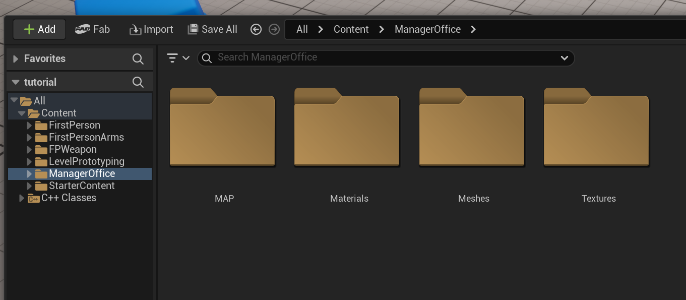
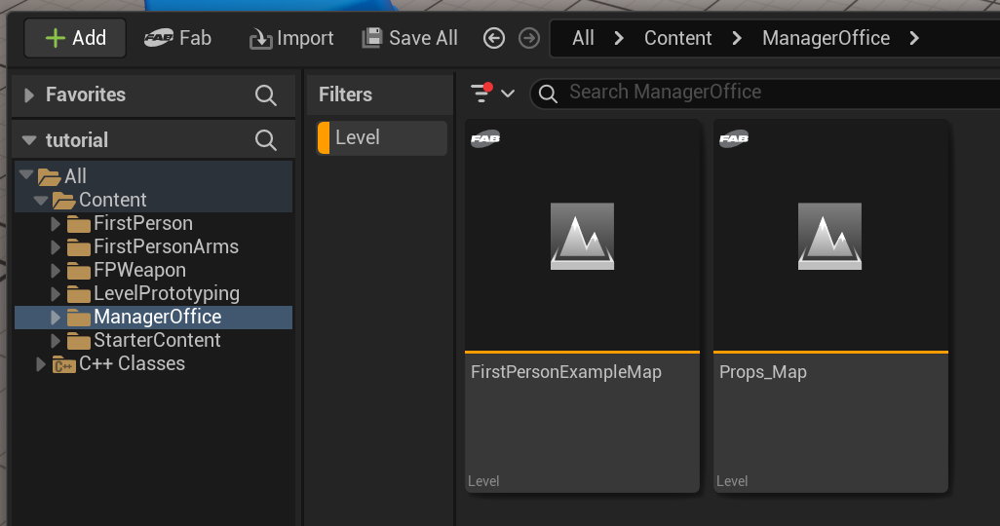
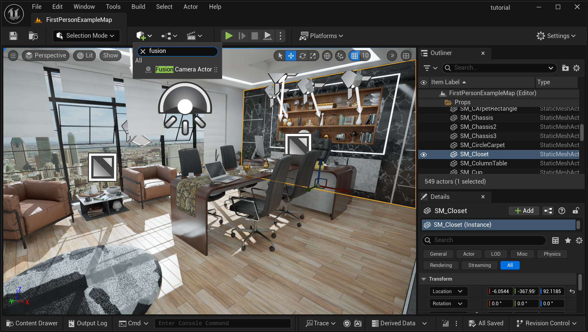
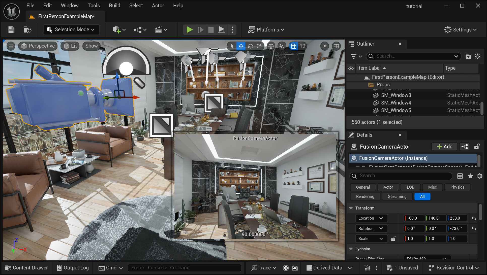
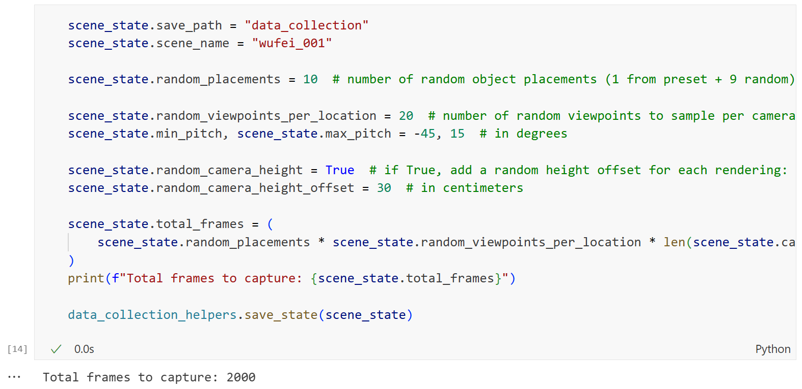
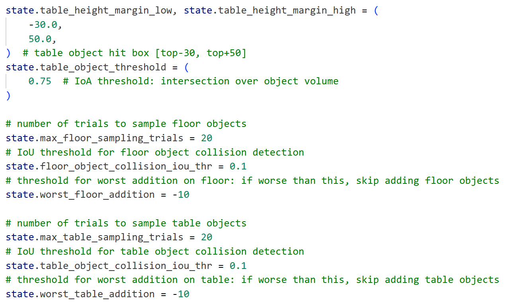
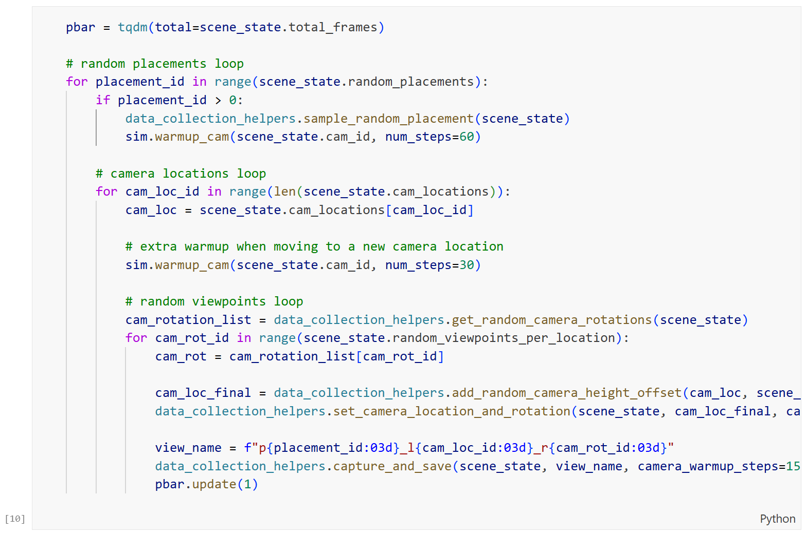

Data Collection
===============

Import Scene
------------

First setup a Unreal Engine project with LychSim plugin enabled by following the `installation instructions <https://wufeim.github.io/LychSim/tutorials/installation.html>`_.

Then drop the scene folder into the `Content` folder of your Unreal project.

Then open the level file of the main scene. A scene often contains multiple levels, such as the demonstration level with a complete map and the overview level showing all assets. Turn on the filter to show only level files.

Set Up Fusion Camera
--------------------

Add a **Fusion Camera Actor** to the scene. This will be the main camera to (1) label camera location, and (2) capture images and other pixel-level annotations.

Adjust the location and orientation of the camera to a desired view using the local 3D axis or the values in the **Transform** panel on the right.

Annotate Basic Scene Information
--------------------------------

Now open the `lychsim_data_collection.ipynb <https://github.com/wufeim/LychSim/blob/main/notebooks/lychsim_data_collection.ipynb>`_ notebook and run the following blocks to iteratively add label basic scene information.

1. Select a floor object in the scene and then run the block to record the floor object.

   .. figure:: figures/data_collection_06.png
      :align: center

2. Select a table object in the scene and then run the block to record the table object.

   .. figure:: figures/data_collection_05.png
      :align: center

3. Move the camera to a desired location and then run the block to record the camera location. The number of camera locations depend on the scale of the scene. On average, we expect 10 camera locations for a medium-sized scene.

   .. figure:: figures/data_collection_07.png
      :align: center

Prepare for Data Collection
---------------------------

Before running the data collection pipeline, we need to set a few parameters in the notebook.

First in this notebook cell, we define the number of random object placements (on both tables and floors) and the number of viewpoints for each camera location. Make sure to set the scene name as the one listed on the `assignments sheet <https://docs.google.com/spreadsheets/d/1Womezyosmi_HfcD-NMb5nQ7fIsV9t0F7VT_mjyK8q08/edit?usp=sharing>`_.

A range of other parameters are defined in `data_collection_helpers.py <https://github.com/wufeim/LychSim/blob/main/notebooks/data_collection_helpers.py>`_, which controls the behavior of the camera and object sampling.

Data Collection
---------------

Lastly, run the data collection block to start the data collection process.

Troubleshooting
---------------

1. **Quality of the RGB rendering quality is bad.**

   This is because it takes a number of frames for temporal anti-aliasing (TAA), temporal super resolution (TSR), Lumen Global Illumination (GI), and other ray tracing effects to converge. If you see a lot of noise or artifacts in the rendering, increase the number of frames in `sim.warmup_cam()` or `data_collection_helpers.capture_and_save()`.

2. **Cannot connect the notebook to UE5.**

   This happens when connecting a second Python runtime to the UE5 LychSim server. Make sure to close other Python runtimes nice with `sim.close()` before starting a new one. A last resort is to restart all Python runtime and the UE5 LychSim server.

   Also refer to the **"Cannot connect to UE5"** issue in the `known issues page <file:///C:/Users/mawuf/Documents/research/LychSim/docs/_build/html/known_issues.html>`_.

   .. figure:: figures/data_collection_11.png
      :align: center
