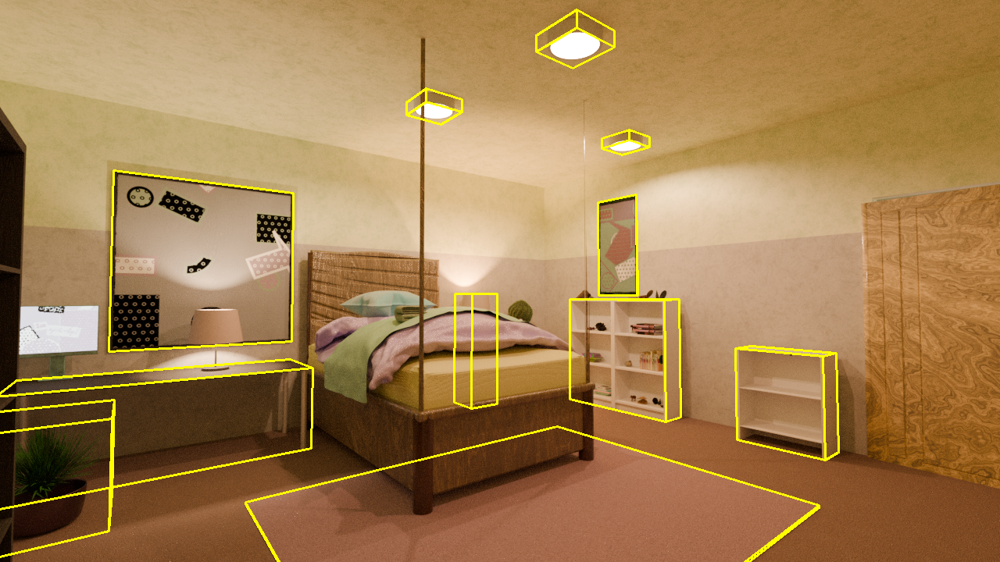
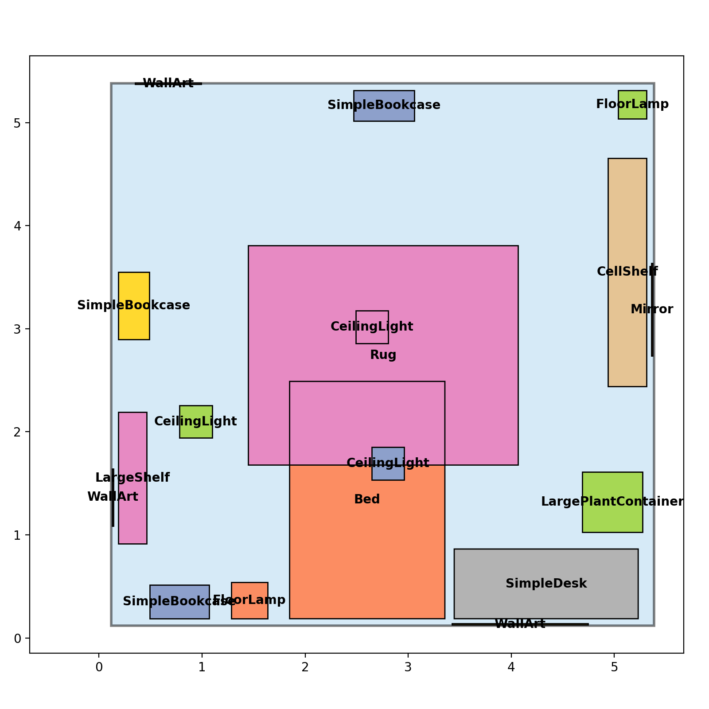

Using LychSim with Infinigen
============================

This section covers how to use LychSim with Infinigen, a tool for generating synthetic indoor scenes.

Generating Infinigen Scenes
---------------------------

Please follow the instructions in :code:`Infinigen` to generate synthetic indoor scenes. Note that :code:`opengl_gt.gin` should be used to `generate ground truth data <https://github.com/princeton-vl/infinigen/blob/main/docs/GroundTruthAnnotations.md#advanced-annotation-pipeline-large_blue_diamond>`_, such as object locations and orientations that are necessary to reconstruct a scene in :code:`LychSim`. As an example,

.. code-block:: bash

    python -m infinigen.datagen.manage_jobs \
        --output_folder outputs/infinigen_scenes --num_scenes 1 \
        --pipeline_configs local_256GB.gin monocular.gin opengl_gt.gin indoor_background_configs.gin \
        --configs fast_solve.gin singleroom.gin \
        --pipeline_overrides get_cmd.driver_script='infinigen_examples.generate_indoors' manage_datagen_jobs.num_concurrent=16 \
        --overrides compose_indoors.restrict_single_supported_roomtype=True compose_indoors.terrain_enabled=False

Loading an Infinigen Scene
--------------------------

An :code:`Infinigen` scene can be loaded into :code:`LychSim`-compatible format using :code:`lychsim.tools.infinigen.load_infinigen_scene` for scene data and :code:`lychsim.tools.infinigen.load_infinigen_frame` for both scene and frame data. For example,

.. code-block:: python

    from lychsim.tools.infinigen import load_infinigen_scene

    scene_path = '/path/to/infinigen/outputs/infinigen_scenes/231233f7'

    # lychsim.core.scene.InfinigenScene
    infinigen_scene = load_infinigen_scene(scene_path)

.. code-block:: python

    from lychsim.tools.infinigen import load_infinigen_frame

    scene_path = '/path/to/infinigen/outputs/infinigen_scenes/231233f7'

    # lychsim.tools.infinigen.InfinigenFrameOutput
    infinigen_frame: InfinigenFrameOutput = load_infinigen_frame(
        scene_path, camera_index=0, frame_index=48)

The :code:`frame_index` parameter can be skipped so the script will automatically load the first available frame.

Visualizing an Infinigen Frame
------------------------------

In this section, we show how to visualize object oriented bounding boxes (OBB) on an :code:`Infinigen` frame.

First we obtain camera extrinsics and intrinsics.

.. code-block:: python

    import numpy as np

    camera_pose_inv = np.linalg.inv(infinigen_frame.camera_pose)
    K = infinigen_frame.K

Prepare a canvas for visualization.

.. code-block:: python

    from lychsim.utils import rgbd2rgb

    orig_image = rgbd2rgb(infinigen_frame.image)
    plot_image = orig_image.copy()

Visualize object OBBs.

.. code-block:: python

    for obj in infinigen_frame.scene.get_all_objects():
        if not infinigen_frame.visibility[obj.uid]:
            continue
        if obj.obb is None:
            continue
        plot_obb(plot_image, obj)

See full script in `example_scripts/infinigen/visualize_infinigen_bbox3d.py <https://github.com/wufeim/LychSim/blob/main/example_scripts/infinigen/visualize_infinigen_bbox3d.py>`_.

Visualizing a Scene Layout
--------------------------

In this section, we show how to visualize a bird's eye view layout of an :code:`Infinigen` scene.

We start by creating an empty canvas.

.. code-block:: python

    import matplotlib.pyplot as plt

    fig, ax = plt.subplots(figsize=(8, 8))

We first visualize the floor of the room.

.. code-block:: python

    from matplotlib.patches import Polygon

    floor_coords = np.array(region.polygon.exterior.coords[:])
    floor_coords = np.concatenate([
        floor_coords, np.zeros((floor_coords.shape[0], 1))], axis=1)
    floor_coords = (
        region.obb.rotation @ floor_coords.T
    ).T + region.obb.translation
    ax.add_patch(Polygon(
        floor_coords[:, :2], facecolor='#AED6F1',
        edgecolor='black', alpha=0.5, linewidth=2))

Then we sort the objects in the room so we visualize them from lower to higher.

.. code-block:: python

    plot_objects = []
    for obj in region.objects:
        corners = obj.obb.corners[:4]
        plot_objects.append((
            obj.name.split('Factory')[0],
            corners[:, :2].tolist(),
            np.mean(corners[:, :2], axis=0),
            float(corners[0, 2])))
    plot_objects.sort(key=lambda x: x[3])

Lastly we draw 2D-view of objects' oriented bounding boxes (OBB) on the canvas.

.. code-block:: python

    for idx, obj in enumerate(plot_objects):
        ax.add_patch(Polygon(
            obj[1], facecolor=object_colors[idx % len(object_colors)]))
    for idx, obj in enumerate(plot_objects):
        ax.add_patch(Polygon(
            obj[1], facecolor='none', edgecolor='black'))
    for idx, obj in enumerate(plot_objects):
        x, y = obj[2]
        ax.text(
            x, y, obj[0], ha='center', va='center',
            fontsize=10, weight='bold')

See full script in `example_scripts/infinigen/visualize_infinigen_regions.py <https://github.com/wufeim/LychSim/blob/main/example_scripts/infinigen/visualize_infinigen_regions.py>`_.
