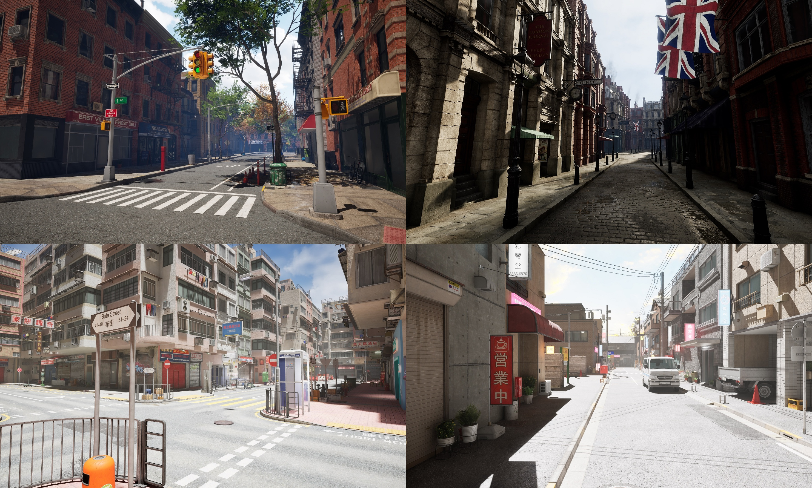
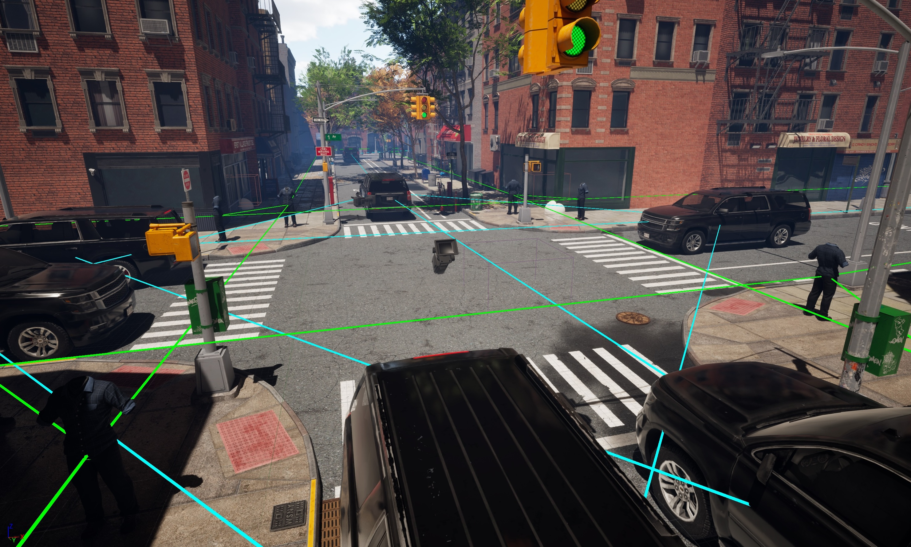
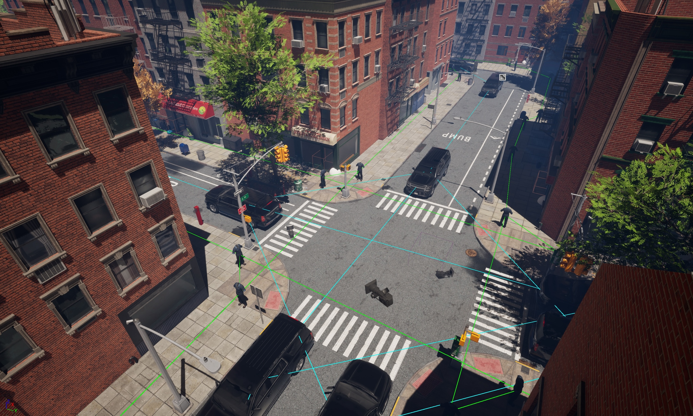
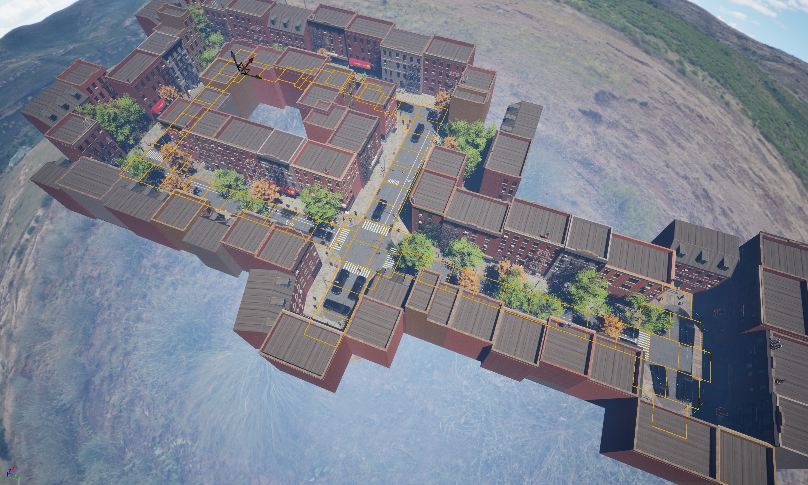
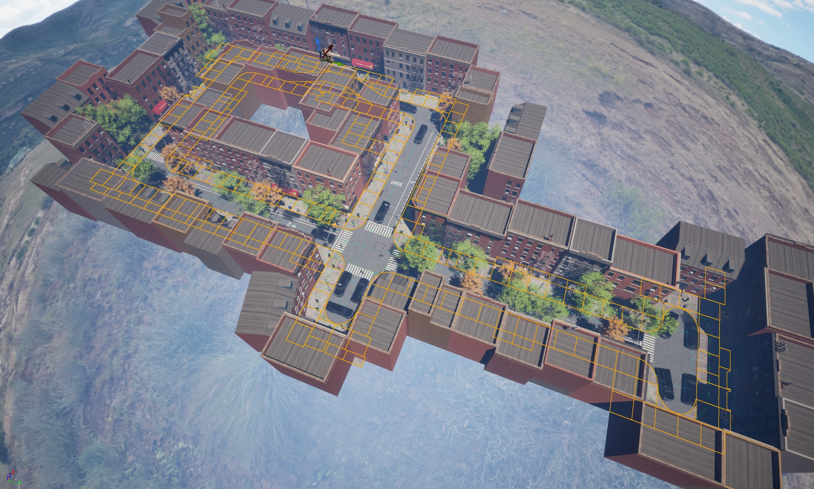

Outdoor Scenes
==============

We will purchase a number of diverse scenes from different contexts, *e.g.*, city or countryside, and diverse appearances, *e.g.*, city in North America and in Asia. However, these scenes come as mostly empty without any pedestrians or vehicles. We will annotate procedural rules to sample (1) moving vehicles, (2) moving pedestrians / cyclists, and (3) general objects on roads or sidewalks.

   Diverse scenes from New York, England, China, and Japan.

Procedural Rules
----------------

We develop tools to annotate and visualize procedural rules in the UE5 editor.

   Procedural rules for vehicles (cyan) and pedestrians / cyclists (green).

   Another example of procedural rules for vehicles (cyan) and pedestrians / cyclists (green).

   Procedurla rules for roads.

   Procedural rules for sidewalks.

Data Generation
---------------

Once we have the procedural rules, we will generate an outdoor dataset with diverse 3D scenes and comprehensive 2D and 3D annotations using an `automatic data collection script <https://github.com/wufeim/LychSim/blob/main/notebooks/lychsim_data_collection.ipynb>`_.

Based on the scene-level and object-level anntations, we can generate a VQA dataset about the outdoor 3D scenes.
